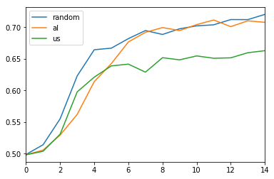

# Diverse Mini-Batch Active Learning

This experiment is based on [paper](https://arxiv.org/pdf/1901.05954.pdf) name Fedor Zhdanov 2019, "Diverse mini-batch Active Learning"

### Packages
- pytorch
- numpy

### Datasets

- Korean movie review data
  - training : (150000, 2)
  - testing : (50000, 2)
- English movie review data
  - training : (40000,2)
  - testing : (10000,2)

Please check this path if you want more detail about preprocessing.
- [Korean data preprocessing](https://github.com/hskimim/active-learning-tutorial/blob/master/Diverse_minibatch_Active_Learning/Korean_MR_Preprocessing.ipynb)
- [English data preprocessing](https://github.com/hskimim/active-learning-tutorial/blob/master/Diverse_minibatch_Active_Learning/English_MV_Preprocessing.ipynb)


### Experiments

First of all, I did three different experiments.
- [K-means Active Learning](https://github.com/hskimim/active-learning-tutorial/blob/master/Diverse_minibatch_Active_Learning/k%3D1000%2Cbeta%3D10.ipynb)
- [Random Sampling](https://github.com/hskimim/active-learning-tutorial/blob/master/Diverse_minibatch_Active_Learning/random_sampling.ipynb)
- [Margin Sampling](https://github.com/hskimim/active-learning-tutorial/blob/master/Diverse_minibatch_Active_Learning/margin_sampling.ipynb)

Operating mini-batch Active Learning by using weighted K-means algorithm. Comparison methodology is "random sampling", "margin sampling"(vanilla active learning)

The number of initial training dataset is 10,000. And add the 1,000 training set under each methodology (random or uncertainty or k-means).

I trained the model for 3 times (3 epoch) and estimated the validation datasets and measured the uncertainty. The reason why I trained model 3 times is it is better to multiple training could contribute to robust performance such as learning curve.

### Korean Movie review data performance (Validation Accuracy)
- random : random sampling
- al : K-means active learning
- us : Uncertainty sampling (Margin sampling)


### English Movie review data performance (Validation Accuracy)
- random : random sampling
- al : K-means active learning
- us : Uncertainty sampling (Margin sampling)



### Conclusion and Further works

K-means Mini-batch algorithm is better than random sampling and margin sampling.
Then, how about adjusting other uncertainty sampling into K-means algorithm such as LC sampling or entropy sampling.
And, I'm gonna experiments more difficult task such as multi-class classification (ex. yelp)

### Issue
```
The hyperparameter I applied is k = 1000, beta = 10. Other hyperparameter can change the result for sure.   
```
```
I don't know why random sampling's validation accuracy is so high.
Im gonna search why it is so high.
And try to fix it or find the reason as soon as possible if I can
```
